# System Architecture Documentation

This document provides comprehensive architecture diagrams for the ECG Remote Patient Monitoring system, including individual component architectures and a high-level system integration view.

---

## 1. DataSimulator Architecture

The DataSimulator is a PyQt6-based application that simulates ECG data from the PhysioNet CinC 2017 dataset and publishes it via MQTT for embedded device consumption.

### Component Diagram

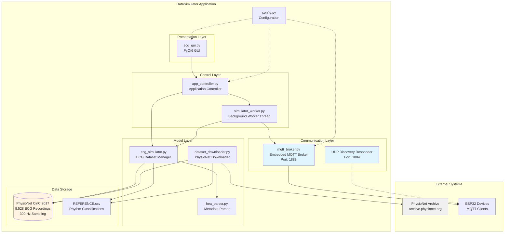

### Data Flow Diagram

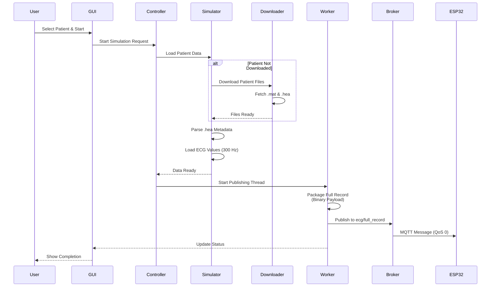

### Key Features

**Architecture Pattern**: Model-View-Controller (MVC) with threading

**Components**:
- **ecg_gui.py**: PyQt6-based user interface with live ECG preview
- **app_controller.py**: Orchestrates application state and coordinates components
- **simulator_worker.py**: Background thread for non-blocking MQTT publishing
- **ecg_simulator.py**: Manages dataset, patient selection, and data loading
- **hea_parser.py**: Parses PhysioNet .hea header files for metadata
- **dataset_downloader.py**: Handles on-demand and bulk dataset downloads
- **mqtt_broker.py**: Embedded pure-Python MQTT broker (no external dependencies)
- **config.py**: Centralized configuration constants

**MQTT Protocol**:
- **Topic**: `ecg/full_record`
- **QoS**: 0 (fire-and-forget)
- **Payload**: Binary format with header + float array
  - Header: format_version, sampling_rate (300 Hz), sample_count, start_timestamp, end_timestamp
  - Body: IEEE-754 float32 array representing ECG voltage in mV
- **Typical Size**: 36 KB for 30s recording (9,000 samples)

**Discovery Protocol**:
- **UDP Broadcast**: Port 1884
- **Response**: Broker IP and port information

---

## 2. IOT (ESP32) Architecture

The IOT layer consists of ESP32 firmware that discovers MQTT brokers, receives full ECG records, and forwards chunked data to the EDGE layer for processing.

### Component Diagram

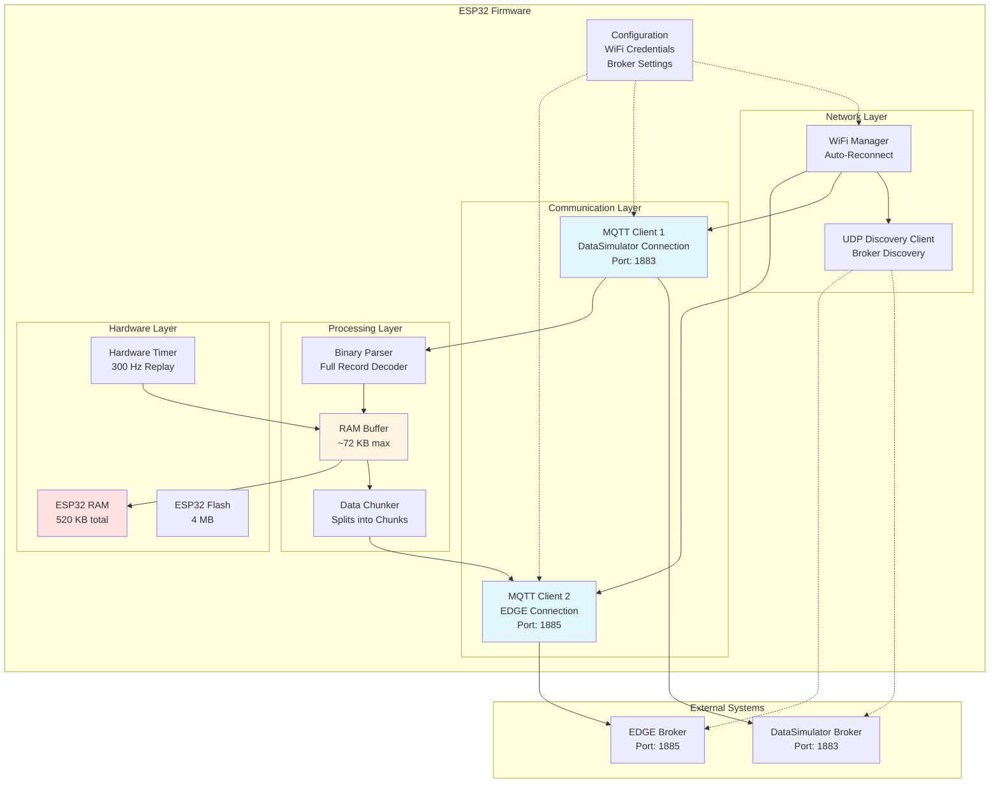

### Data Flow Diagram

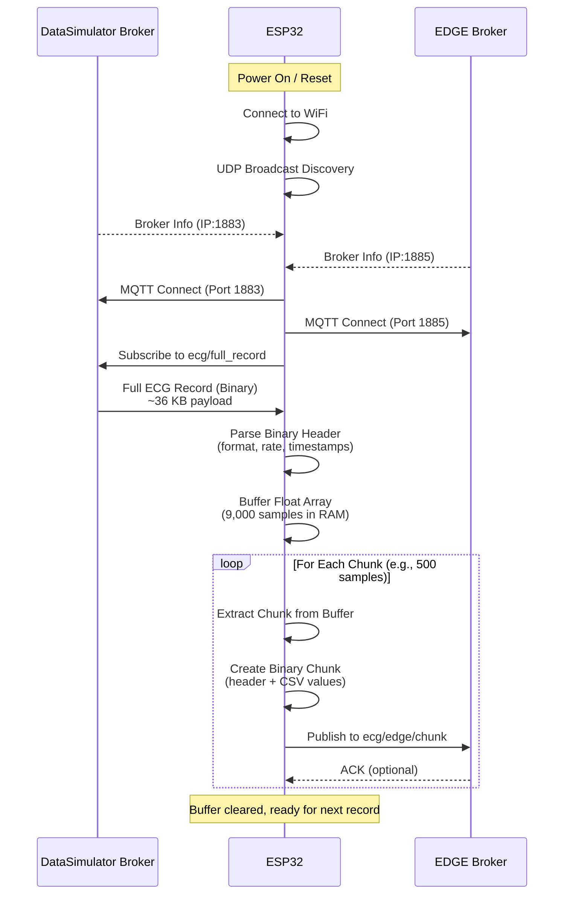

### Key Features

**Hardware Platform**: ESP32 (any variant)
- **RAM**: 520 KB (sufficient for 60s ECG records)
- **Flash**: 4 MB
- **WiFi**: 802.11 b/g/n

**Firmware Components**:
- **WiFi Manager**: Automatic connection and reconnection
- **UDP Discovery**: Finds DataSimulator and EDGE brokers automatically
- **Dual MQTT Clients**: Separate connections to DataSimulator (1883) and EDGE (1885)
- **Binary Parser**: Decodes full-record binary payload
- **Data Chunker**: Splits large records into manageable chunks for EDGE
- **Error Handling**: Comprehensive exception handling and recovery

**Communication Protocols**:
1. **Receive from DataSimulator**:
   - Topic: `ecg/full_record`
   - Format: Binary (header + float32 array)
   - Size: ~36 KB typical

2. **Send to EDGE**:
   - Topic: `ecg/edge/chunk`
   - Format: Binary header + CSV body
   - Chunk Size: Configurable (e.g., 500 samples)

**Memory Management**:
- Full record buffered in RAM
- Chunked transmission to minimize EDGE memory requirements
- Automatic buffer cleanup after transmission

---

## 3. EDGE Architecture

The EDGE layer runs on a Raspberry Pi 4 and serves as the intelligent processing gateway between ESP32 devices and the Web Portal.

### Component Diagram

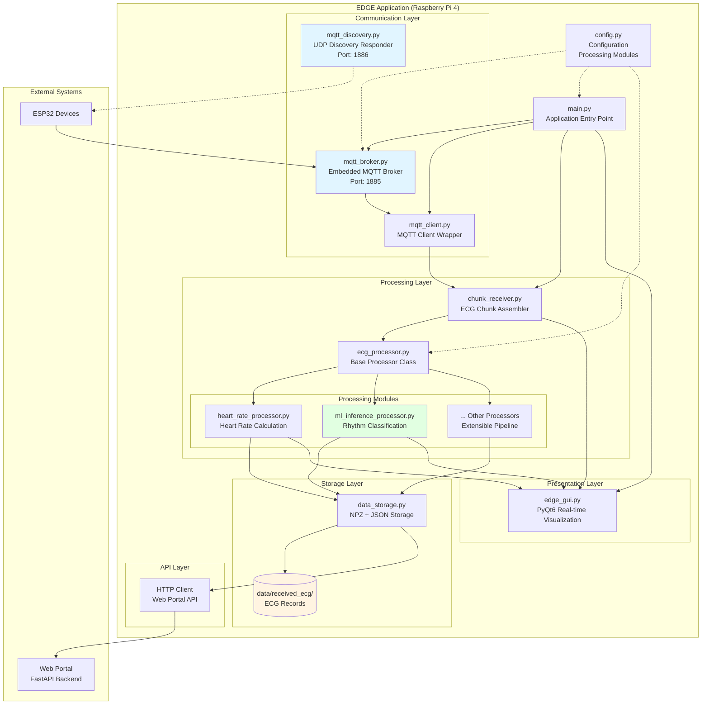

### Data Flow Diagram

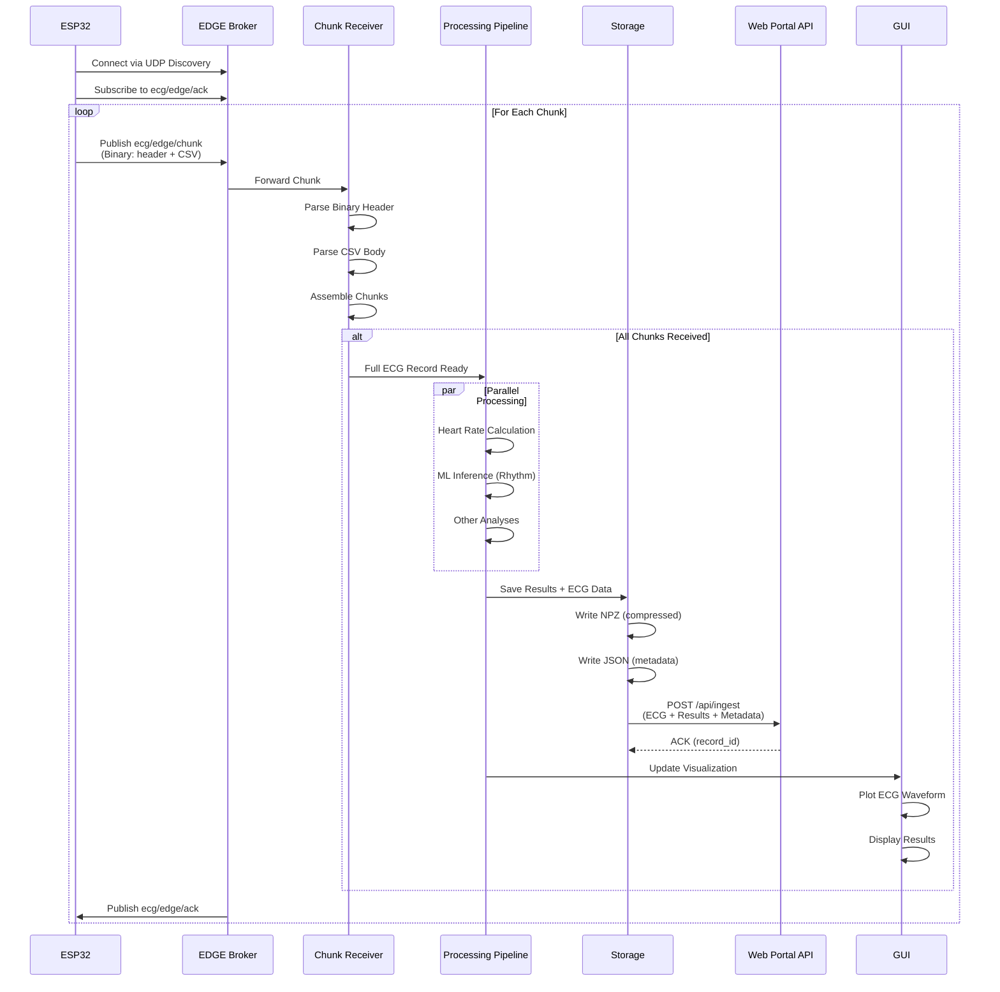

### Key Features

**Platform**: Raspberry Pi 4 (or similar Linux SBC)

**Architecture Pattern**: Modular Processing Pipeline

**Core Components**:
- **mqtt_broker.py**: Embedded MQTT broker for receiving from ESP32 (Port 1885)
- **mqtt_discovery.py**: UDP responder for broker discovery (Port 1886)
- **mqtt_client.py**: MQTT client wrapper for internal communication
- **chunk_receiver.py**: Assembles chunked ECG data from ESP32
- **ecg_processor.py**: Base class for extensible processing modules
- **data_storage.py**: Saves ECG data and results to disk
- **edge_gui.py**: Real-time ECG visualization with PyQt6
- **main.py**: Application orchestration and lifecycle management

**Processing Modules** (Extensible):
- **heart_rate_processor.py**: R-peak detection and heart rate calculation
- **ml_inference_processor.py**: Trained ML model for rhythm classification
- **Custom processors**: Easily add new processing modules

**MQTT Protocol**:
- **Receive Topic**: `ecg/edge/chunk`
- **ACK Topic**: `ecg/edge/ack`
- **Chunk Format**: Binary header (12 bytes) + CSV body
  - Header: format_version, sampling_rate, chunk_num, total_chunks, sample_count
  - Body: Comma-separated float values

**Data Storage**:
- **Format**: NPZ (compressed numpy) + JSON (metadata)
- **Location**: `./data/received_ecg/`
- **Naming**: `ecg_TIMESTAMP.npz` and `ecg_TIMESTAMP_metadata.json`

**Web Portal Integration**:
- **Endpoint**: `POST /api/ingest`
- **Payload**: ECG values, processing results, metadata
- **Response**: Record ID for tracking

**Discovery Protocol**:
- **UDP Port**: 1886 (different from DataSimulator's 1884)
- **Response**: EDGE broker IP and port (1885)

---

## 4. Web Portal Architecture

The Web Portal is a FastAPI-based secure web application for doctors to view ECG data, patient timelines, and audit trails.

### Component Diagram

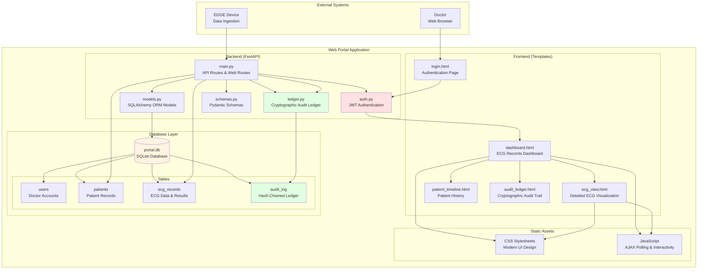

### Data Flow Diagram

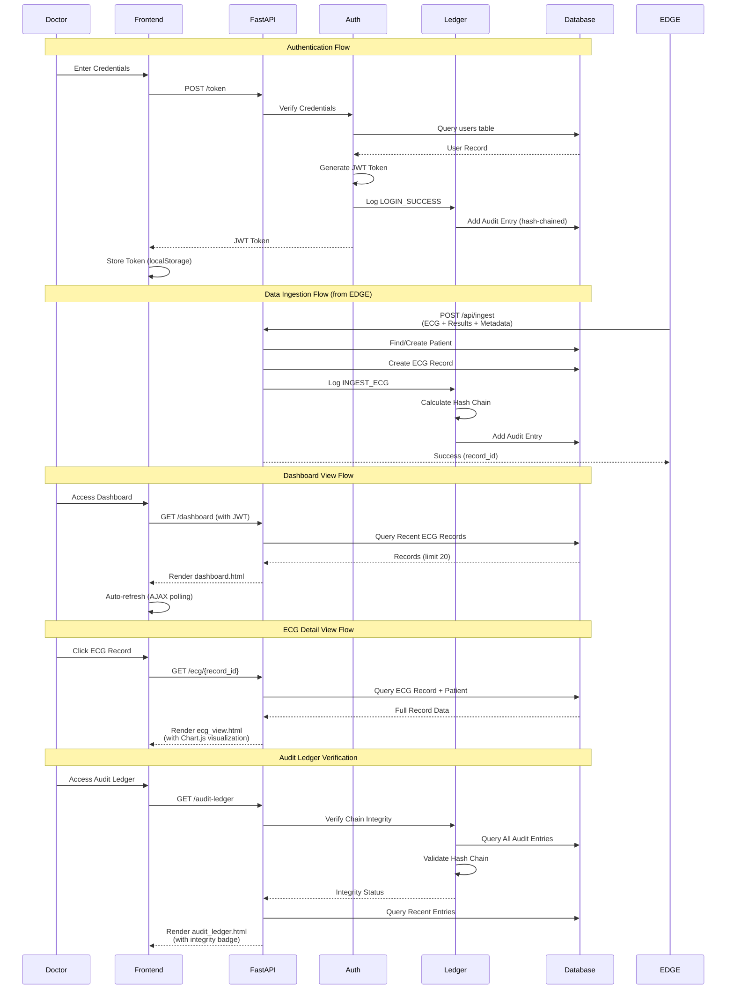

### Key Features

**Framework**: FastAPI (Python)
- **Async Support**: High-performance async request handling
- **Auto Documentation**: OpenAPI/Swagger UI
- **Type Safety**: Pydantic schema validation

**Frontend**:
- **Template Engine**: Jinja2
- **Styling**: Modern CSS with responsive design
- **Interactivity**: Vanilla JavaScript with AJAX polling
- **Visualization**: Chart.js for ECG waveform rendering

**Authentication**:
- **Method**: JWT (JSON Web Tokens)
- **Storage**: localStorage (client-side)
- **Expiration**: Configurable token lifetime
- **Security**: Bcrypt password hashing

**Database** (SQLite):
- **users**: Doctor accounts (username, hashed_password, role)
- **patients**: Patient information (patient_id_external, name, dob)
- **ecg_records**: ECG data, processing results, metadata
- **audit_log**: Hash-chained cryptographic audit trail

**Cryptographic Audit Ledger**:
- **Hash Chain**: Each entry contains hash of previous entry
- **Immutability**: Any tampering breaks the chain
- **Verification**: `/api/audit/verify` endpoint checks integrity
- **Logged Actions**: LOGIN_SUCCESS, INGEST_ECG, VIEW_RECORD, etc.

**API Endpoints**:
- **POST /token**: Authentication (returns JWT)
- **GET /dashboard**: Main dashboard view
- **GET /ecg/{record_id}**: Detailed ECG view
- **GET /patient/{patient_id}**: Patient timeline
- **GET /audit-ledger**: Cryptographic audit trail view
- **POST /api/ingest**: Data ingestion from EDGE (public)
- **GET /api/audit/verify**: Verify audit chain integrity
- **GET /api/patients/search**: Patient search

**Security Features**:
- JWT-based authentication
- Password hashing (Bcrypt)
- Cryptographic audit trail (hash-chained)
- HTTPS ready (production deployment)
- Role-based access control (extensible)

---

## 5. High-Level System Integration Architecture

This diagram shows how all components interact to form the complete Remote Patient Monitoring system.

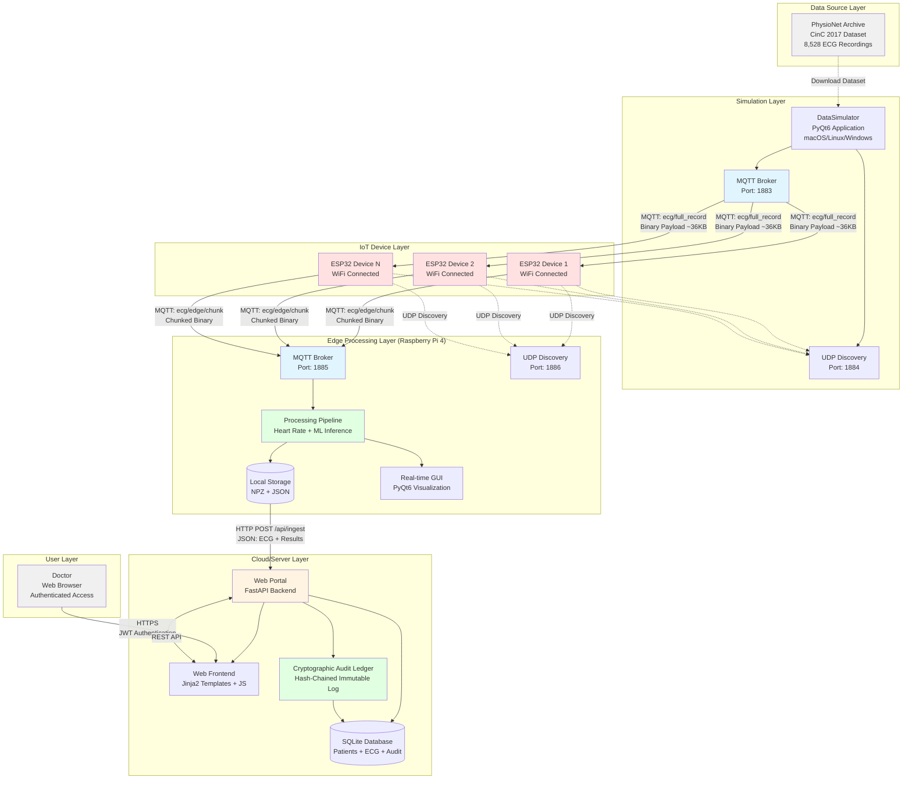

### System-Wide Data Flow

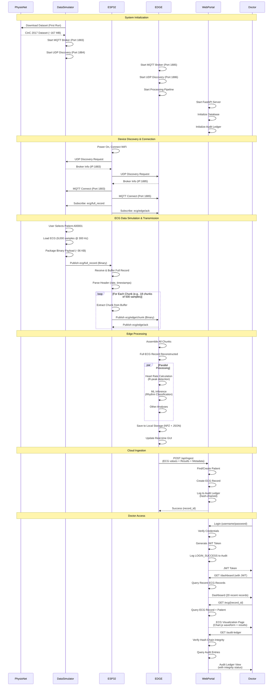

### Communication Protocols Summary

| Source | Destination | Protocol | Port | Topic/Endpoint | Format | Purpose |
|--------|-------------|----------|------|----------------|--------|---------|
| DataSimulator | ESP32 | MQTT | 1883 | `ecg/full_record` | Binary (header + float32[]) | Full ECG record transmission |
| DataSimulator | ESP32 | UDP | 1884 | Broadcast | JSON | Broker discovery |
| ESP32 | EDGE | MQTT | 1885 | `ecg/edge/chunk` | Binary (header + CSV) | Chunked ECG data |
| ESP32 | EDGE | UDP | 1886 | Broadcast | JSON | Broker discovery |
| EDGE | ESP32 | MQTT | 1885 | `ecg/edge/ack` | JSON | Chunk acknowledgment |
| EDGE | Web Portal | HTTP | 8000 | `POST /api/ingest` | JSON | ECG data + results ingestion |
| Doctor | Web Portal | HTTPS | 8000 | Various REST endpoints | JSON/HTML | Web interface access |

### Technology Stack Summary

| Layer | Platform | Language | Framework | Database | Key Libraries |
|-------|----------|----------|-----------|----------|---------------|
| **DataSimulator** | macOS/Linux/Windows | Python 3.8+ | PyQt6 | File-based (PhysioNet dataset) | scipy, numpy, paho-mqtt |
| **IOT** | ESP32 | C++ | Arduino/PlatformIO | N/A (RAM-based) | PubSubClient, ArduinoJson, WiFi |
| **EDGE** | Raspberry Pi 4 | Python 3.8+ | PyQt6 | File-based (NPZ + JSON) | numpy, scipy, paho-mqtt, scikit-learn |
| **Web Portal** | Linux/Cloud | Python 3.8+ | FastAPI | SQLite | SQLAlchemy, Jinja2, Pydantic, JWT |

### System Characteristics

**Scalability**:
- Multiple ESP32 devices can connect to single EDGE instance
- Multiple EDGE instances can send data to single Web Portal
- Web Portal can be scaled horizontally with load balancer

**Reliability**:
- Automatic reconnection at all layers (WiFi, MQTT)
- Comprehensive error handling and logging
- Data persistence at EDGE and Web Portal layers
- Cryptographic audit trail for data integrity

**Security**:
- JWT authentication for Web Portal
- Bcrypt password hashing
- Hash-chained audit ledger (immutable)
- HTTPS ready for production deployment
- Network segmentation (separate MQTT brokers)

**Performance**:
- Real-time ECG transmission (300 Hz sampling rate)
- Efficient binary protocols (minimal overhead)
- Parallel processing at EDGE layer
- Async request handling at Web Portal
- AJAX polling for live dashboard updates

**Extensibility**:
- Modular processing pipeline (EDGE)
- Pluggable processors (easy to add new analyses)
- RESTful API (Web Portal)
- Configurable via config files
- Open architecture for integration

---

## Deployment Architecture

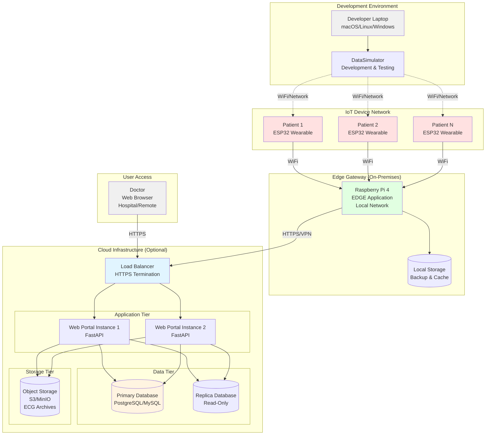

### Deployment Scenarios

**Scenario 1: Development/Testing**
- DataSimulator on developer laptop
- ESP32 on local WiFi network
- EDGE on Raspberry Pi (local network)
- Web Portal on localhost or local server

**Scenario 2: Clinical Pilot**
- DataSimulator replaced by real ECG sensors (future)
- ESP32 devices on patients (wearable)
- EDGE on Raspberry Pi (hospital network)
- Web Portal on hospital server (internal network)

**Scenario 3: Production Deployment**
- Real ECG sensors integrated with ESP32
- Multiple EDGE gateways (per ward/clinic)
- Web Portal on cloud infrastructure (AWS/Azure/GCP)
- Load balancing and database replication
- Object storage for long-term ECG archives
- HTTPS with SSL/TLS certificates
- VPN for EDGE-to-Cloud communication

---

## Summary

This architecture documentation provides comprehensive views of:

1. **DataSimulator**: Simulation layer for ECG data generation and MQTT publishing
2. **IOT (ESP32)**: Embedded device layer for data reception and forwarding
3. **EDGE**: Intelligent processing gateway with ML inference and data aggregation
4. **Web Portal**: Secure web application for clinical access and audit trails
5. **System Integration**: End-to-end data flow and component interactions

The system demonstrates a modern IoT architecture with:
- **Edge Intelligence**: Processing at the edge reduces latency and bandwidth
- **Security**: Multi-layer security with authentication, encryption, and audit trails
- **Scalability**: Modular design supports horizontal scaling
- **Reliability**: Automatic reconnection and error handling at all layers
- **Extensibility**: Plugin architecture for new processing modules and features

This architecture is suitable for research, clinical pilots, and production deployment in remote patient monitoring scenarios.
