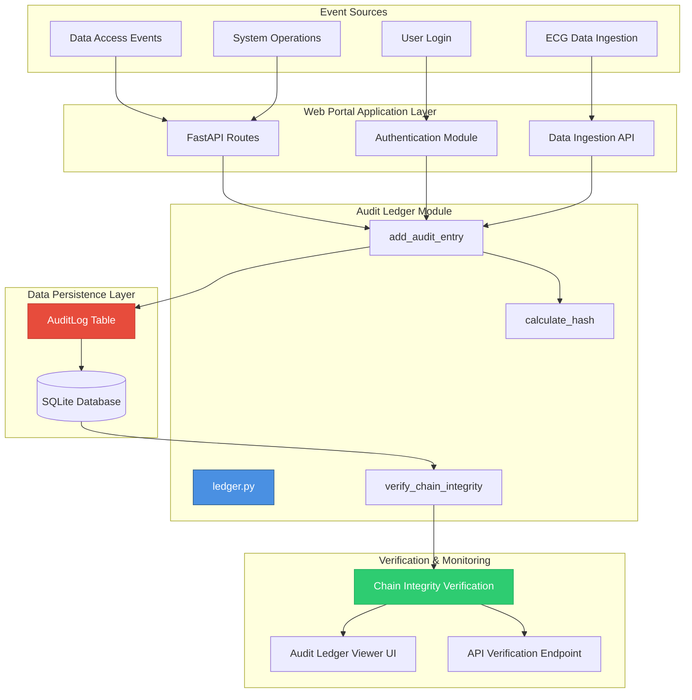
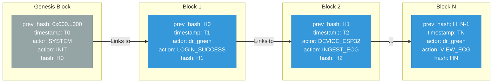
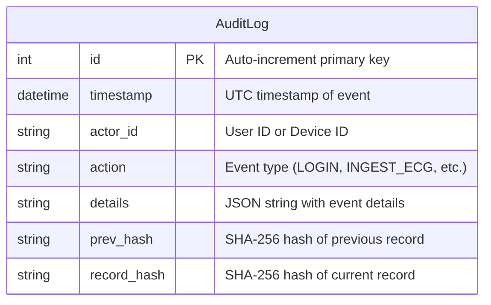
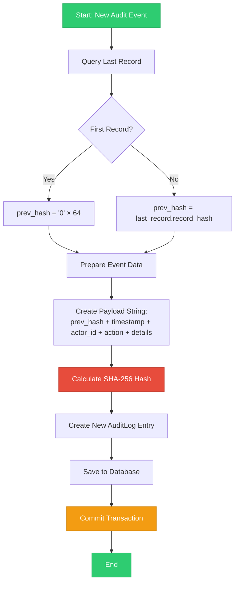
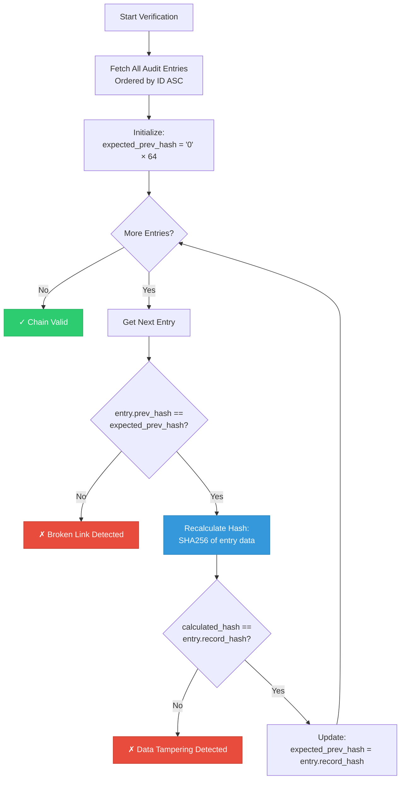
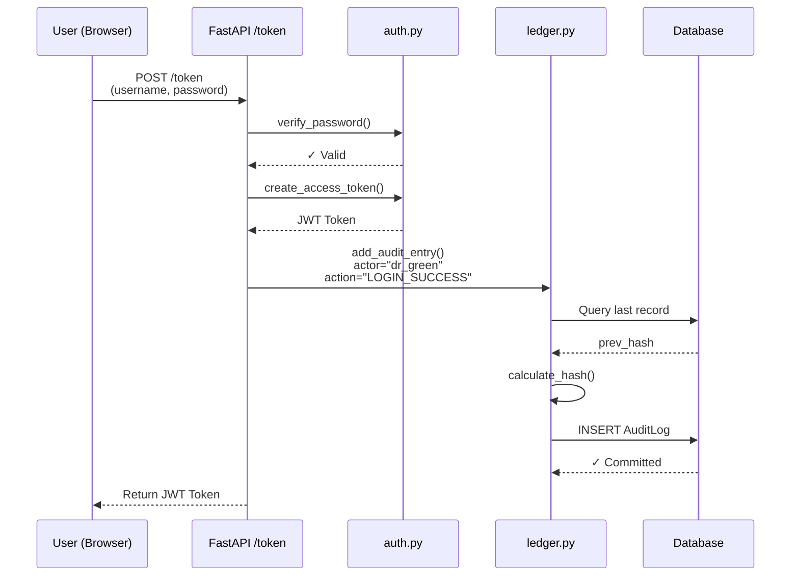
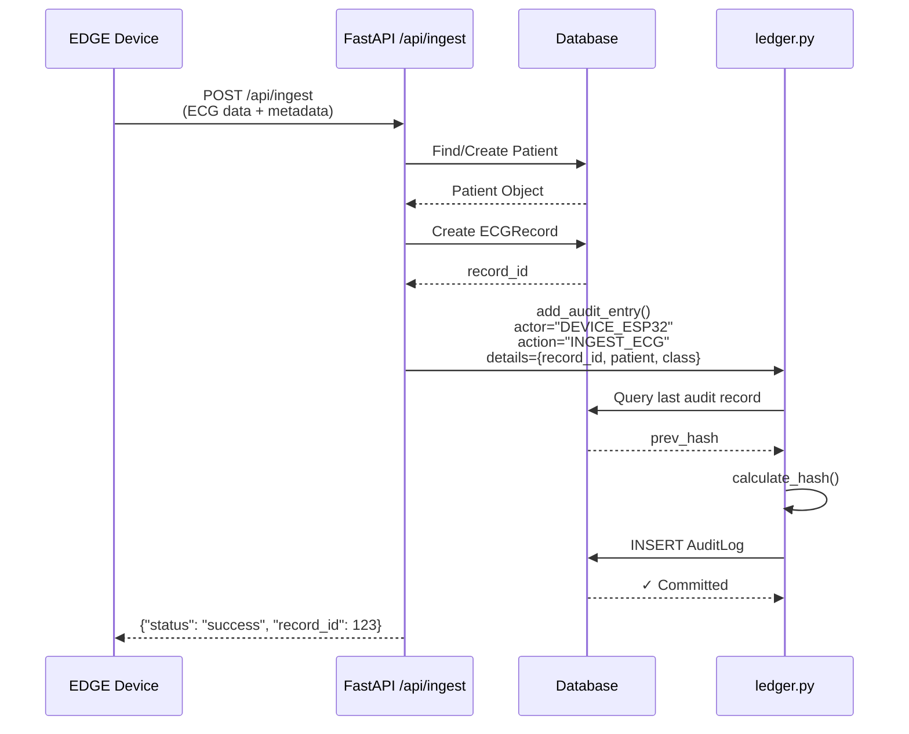
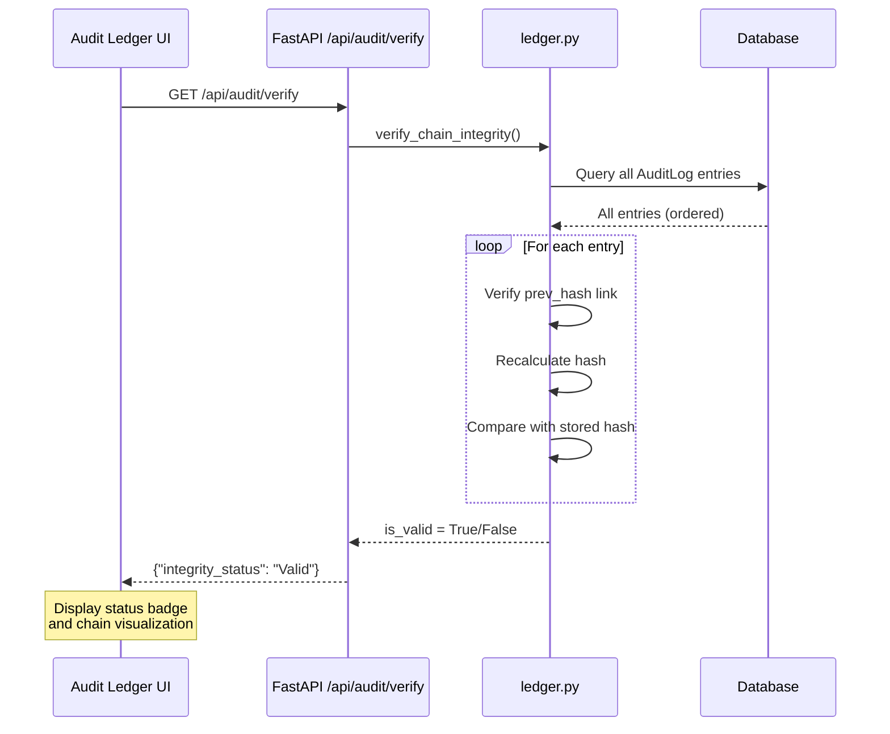
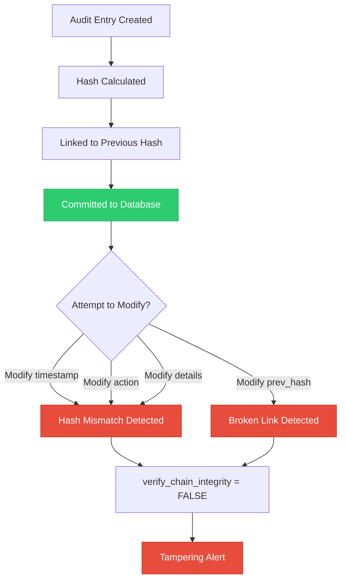

# Audit Ledger Architecture - Web Portal

## Overview

The Web Portal implements a **Hash-Chained Audit Ledger** for integrity verification and tamper detection. This is a cryptographically-linked immutable log that ensures all system actions are permanently recorded and verifiable.

## System Architecture



## Hash-Chain Structure



## Data Model

### AuditLog Table Schema



**Field Descriptions:**
- **id**: Sequential identifier for database indexing
- **timestamp**: When the event occurred (UTC)
- **actor_id**: Who performed the action (user or device)
- **action**: Type of event (LOGIN_SUCCESS, INGEST_ECG, VIEW_ECG, etc.)
- **details**: JSON-encoded additional information
- **prev_hash**: Cryptographic link to previous record (64-char hex)
- **record_hash**: SHA-256 hash of this record's content (64-char hex)

## Hash Calculation Algorithm



**Hash Formula:**
```
record_hash = SHA256(prev_hash || timestamp || actor_id || action || details)
```

Where `||` represents string concatenation.

## Integrity Verification Process



## Event Flow Examples

### Example 1: User Login Event



### Example 2: ECG Data Ingestion Event



### Example 3: Chain Integrity Verification



## User Interface Components

### Audit Ledger Viewer

The Web Portal provides a dedicated UI at `/audit-ledger` that displays:

1. **Chain Integrity Status Badge**
   - Green: ✓ Valid - All hashes verified
   - Red: ✗ CORRUPTED - Tampering detected

2. **Audit Entry Table**
   - Timestamp (UTC)
   - Actor ID (User or Device)
   - Action Type
   - Details (JSON formatted)
   - Previous Hash (truncated)
   - Record Hash (truncated)

3. **Visual Chain Representation**
   - Shows cryptographic linkage between entries
   - Highlights any broken links or hash mismatches

## Security Properties

### Immutability Guarantees



### Tamper Detection Mechanisms

1. **Hash Verification**: Each record's hash is recalculated and compared
2. **Chain Linkage**: Each record must point to the correct previous hash
3. **Sequential Integrity**: Any modification breaks the chain from that point forward
4. **Append-Only**: New entries can only be added to the end of the chain

## API Endpoints

### Audit-Related Endpoints

| Endpoint | Method | Purpose | Response |
|----------|--------|---------|----------|
| `/api/audit/verify` | GET | Verify chain integrity | `{"integrity_status": "Valid\|CORRUPTED"}` |
| `/audit-ledger` | GET | View audit ledger UI | HTML page with entries and status |

### Events Logged to Audit Ledger

| Event Type | Actor | Details |
|------------|-------|---------|
| `LOGIN_SUCCESS` | Username | IP address |
| `INGEST_ECG` | Device ID | Record ID, Patient ID, Classification |
| `USER_CREATE` | SYSTEM | Username, Role |
| `VIEW_ECG` | Username | Record ID (future) |
| `DATA_EXPORT` | Username | Export parameters (future) |

## Key Differences from Traditional Blockchain

> [!IMPORTANT]
> This system is a **Hash-Chained Audit Ledger**, not a traditional blockchain:

| Feature | Traditional Blockchain | This Audit Ledger |
|---------|----------------------|-------------------|
| **Consensus** | Distributed (PoW, PoS, etc.) | Single authority (Web Portal) |
| **Network** | Peer-to-peer | Centralized database |
| **Validation** | Multiple nodes | Single server verification |
| **Purpose** | Decentralized trust | Tamper detection & audit trail |
| **Performance** | Slower (consensus overhead) | Fast (local database) |
| **Use Case** | Cryptocurrency, DApps | Clinical audit logging |

**Why This Design?**

- ✓ **Regulatory Compliance**: Immutable audit trail for medical data
- ✓ **Tamper Detection**: Any modification is immediately detectable
- ✓ **Performance**: No consensus overhead, suitable for high-frequency events
- ✓ **Simplicity**: Easier to implement and maintain than distributed blockchain
- ✓ **Sufficient Security**: For permissioned medical system with trusted operators

## Implementation Files

| File | Purpose | Key Functions |
|------|---------|---------------|
| [ledger.py](file:///Volumes/Stuff/GDrive2026/Abertay/research/DEVWORK/WEB/ledger.py) | Core audit ledger logic | `add_audit_entry()`, `calculate_hash()`, `verify_chain_integrity()` |
| [models.py](file:///Volumes/Stuff/GDrive2026/Abertay/research/DEVWORK/WEB/models.py#L48-L66) | Database schema | `AuditLog` model definition |
| [main.py](file:///Volumes/Stuff/GDrive2026/Abertay/research/DEVWORK/WEB/main.py) | API endpoints & event triggers | Login, ingestion, verification endpoints |

## Future Enhancements

> [!TIP]
> Potential improvements for enhanced security and functionality:

1. **Digital Signatures**: Add cryptographic signatures from actors
2. **Merkle Trees**: Implement Merkle tree for efficient batch verification
3. **Periodic Anchoring**: Publish hash checkpoints to external immutable storage
4. **Real-time Monitoring**: Alert system for integrity violations
5. **Audit Search**: Advanced filtering and search capabilities
6. **Export Compliance**: Generate audit reports for regulatory submissions
